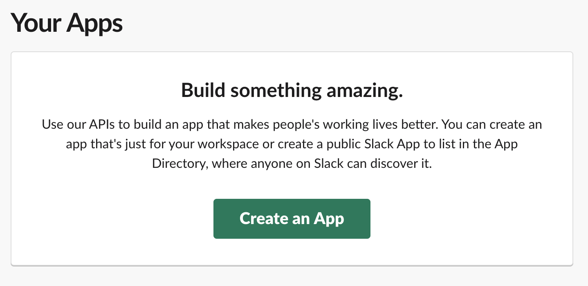
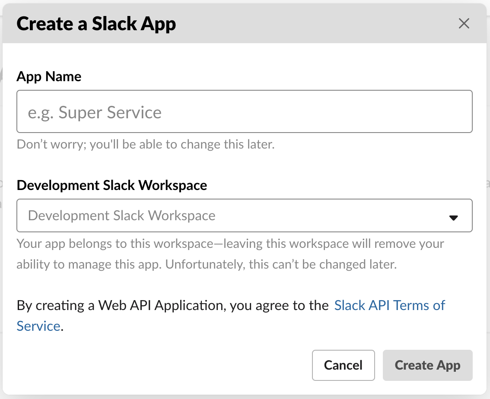
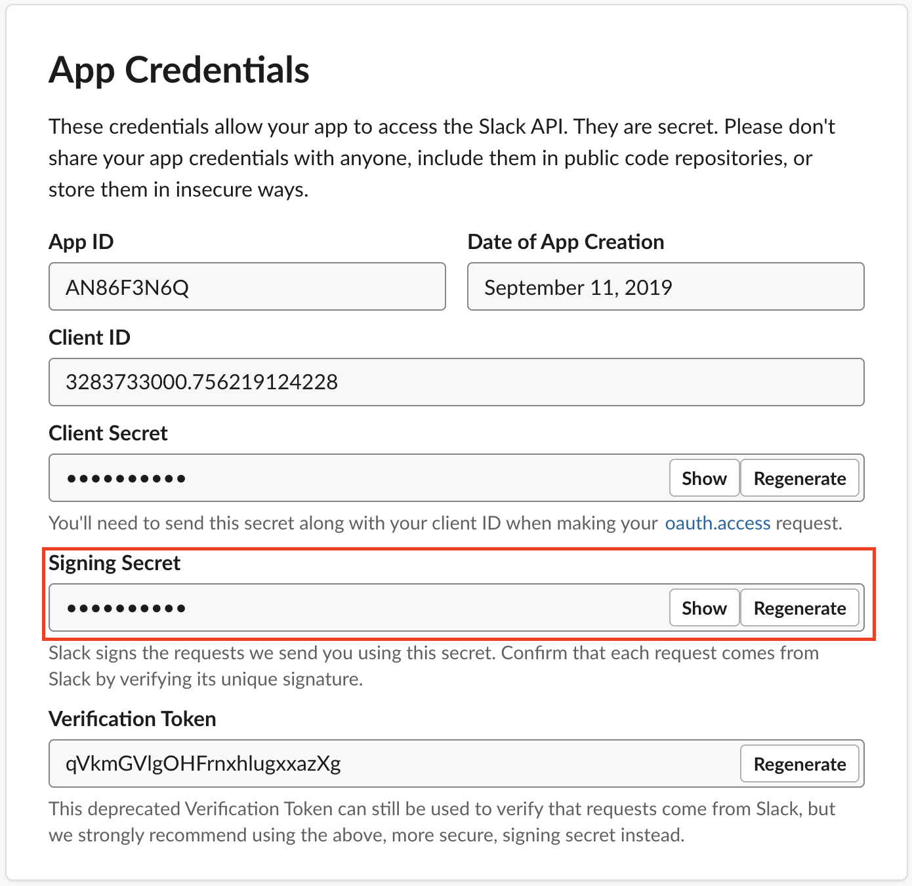
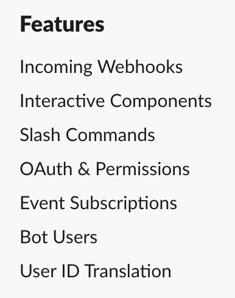
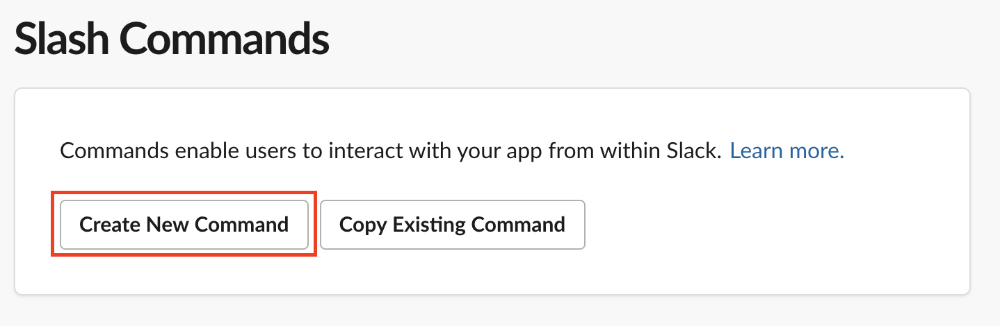
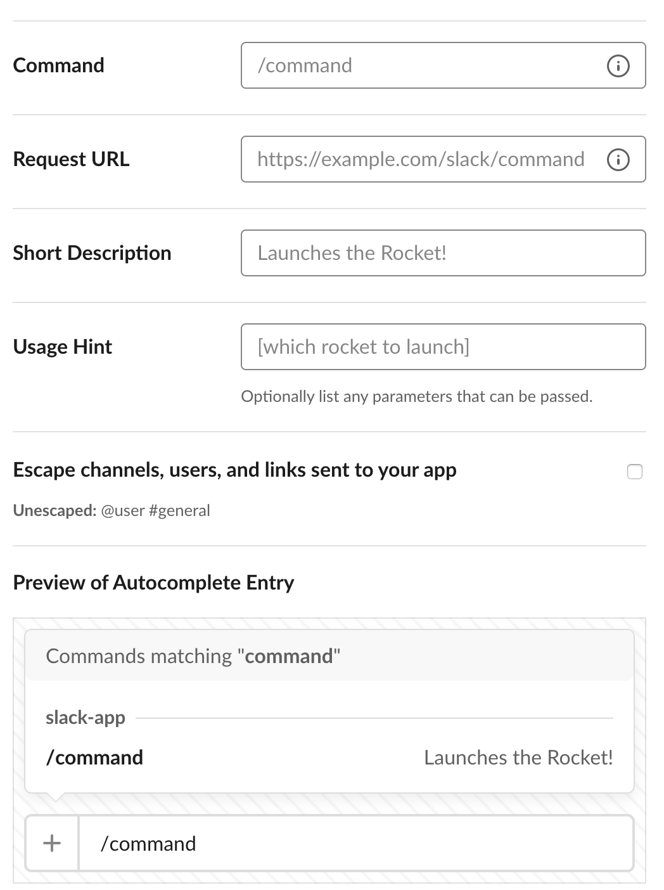
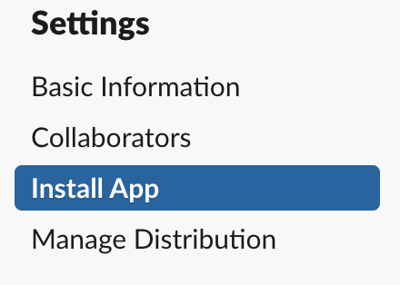
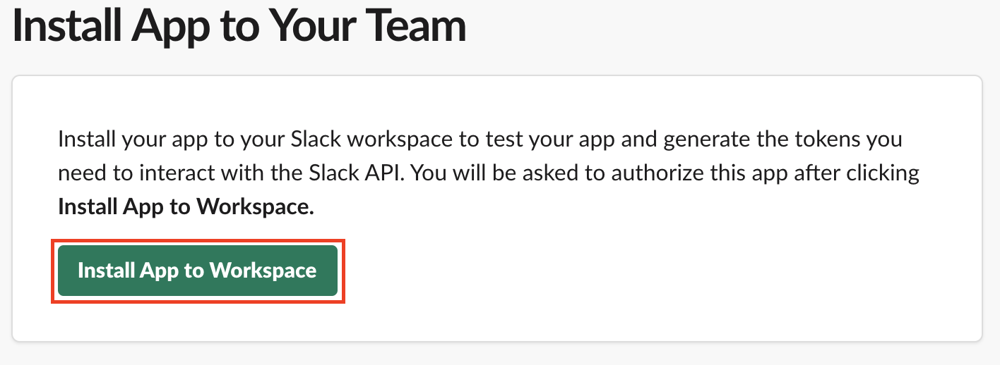
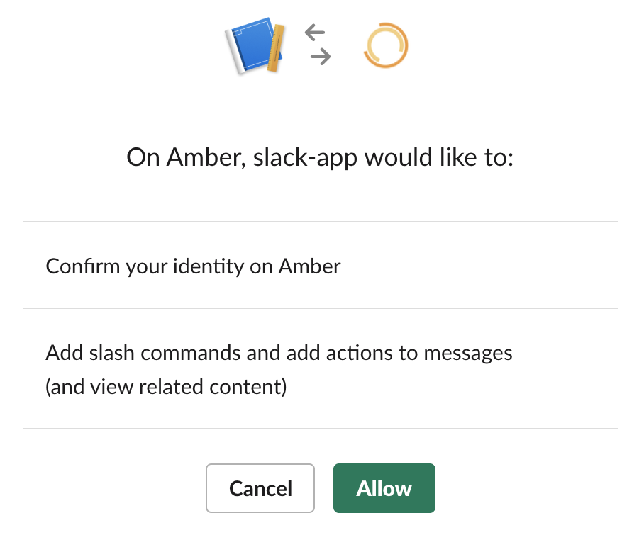

# Slack App

A template repository to deploy a Slack App to AWS API Gateway & AWS Lambda.

## Quickstart

### 1. Create an App in Slack

Visit https://api.slack.com/apps and click "Create an App"



Pick a name and the workspace that the application belongs to



### 2. Get the Slack App's Signing Secret

In your app's details page, in the **App Credentials** section, get the value for the *Signing Secret*.



### 3. Deploy Application to AWS

Run the following:

```
sam package --s3-bucket ae-lambda-deploy --output-template-file packaged.yaml && aws cloudformation deploy --capabilities CAPABILITY_IAM --template-file packaged.yaml --parameter-overrides SigningSecret=<SIGNING_SECRET> --stack-name <STACK_NAME>
```

...where: 
- `<SIGNING_SECRET>` corresponds to the Signing Secret from Step 2
- `<STACK_NAME>` is a name that you want to give the AWS Cloudformation Stack


### 4. Configure a feature for your Slack App

Before the Slack App can be installed to the workspace, a feature needs to be configured.



The easiest feature to configure is a **Slash Command**



Complete the slash command form and submit to add the feature to the Slack App.




### 5. Install Slack App to Workspace

Select **Install App** in the Settings section of the Slack App dashboard.



Click **Install App to Workspace**.



Authorize the App to work within your workspace


